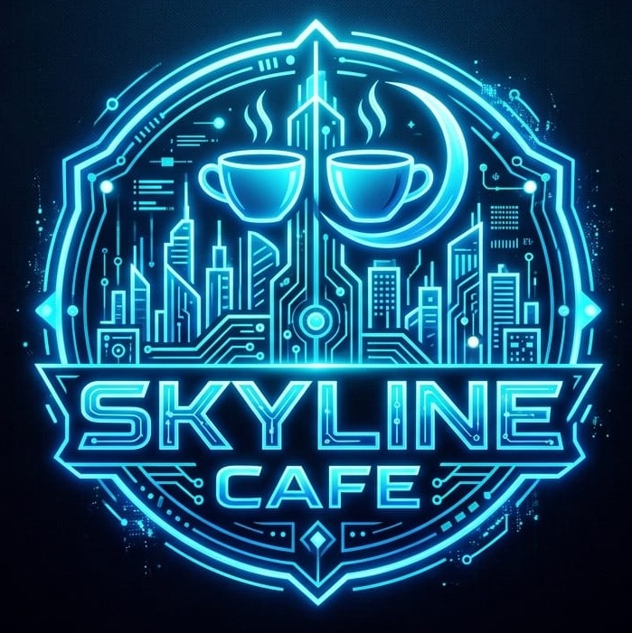

<div align="center">



# ☕ Skyline Cafe — Management System

*A Premium & Lightweight Desktop Solution for Modern Cafeteria Operations*

[](https://www.java.com)
[](https://www.sqlite.org)
[](https://docs.oracle.com/javase/tutorial/uiswing/)
[](https://www.microsoft.com/windows)

🚀 [Quick Setup](#-installation-guide) &nbsp;•&nbsp; 🛠️ [Source Execution](#%EF%B8%8F-developer-setup) &nbsp;•&nbsp; 💎 [Core Modules](#-application-modules)

---

</div>

## 📑 Project Overview & Metadata

| Attribute | Information |
| :--- | :--- |
| 🏫 **Institution** | Mehran University of Engineering & Technology, Khairpur Mir's |
| 🧪 **Laboratory/Course** | Object Oriented Programming (SW121) |
| 👨‍🏫 **Course Supervisor** | Engr. Asmatullah Zubair |
| 👥 **Academic Cohort** | Batch K25SW |
| 🧑‍💻 **Lead Developer** | Muhammad Umar Farooque — **Roll No:** K25SW04 |
| 📅 **Release Date** | May 2026 |

---

## 💎 Application Modules

### ⚙️ Control Panel & Security
* **Multi-Tier Access:** Secure environment with distinct interfaces for **Administrators** and **Staff Members**.
* **Role Enforcement:** Dynamic feature restriction based on verified user credentials.
* **Visual Feedback:** Interactive UI animations (shake alert) triggered upon unauthorized login attempts.

### 📈 Business Analytics Engine
* **Real-time Metrics:** Instant summary grids showcasing Net Revenue, Daily Sales, and Historical Averages.
* **Graphical Tracking:** Clean 7-day data visualization using built-in reactive bar charts.
* **Background Threads:** Automated UI data synchronization routine operating every 30 seconds.

### 🍽️ Digital Menu Controller
* **CRUD Layer:** Fully operational creation, editing, and archiving operations for food items.
* **Categorized Matrix:** Native partitioning across 5 major departments (*Hot Brews, Cold Brews, Appetizers, Main Meals, Pastries*).
* **Smart Filter:** Instant search indexing by menu labels along with structural filters for stock availability.

### 🛒 Point of Sale (POS) & Order Pipeline
* **Interactive Cart:** On-the-fly computational subtotaling, dynamic quantity updates, and overhead multipliers.
* **Automated Invoicing:** Programmatic layout architecture that generates thermal-style transactional receipts instantly.
* **Audit Trails:** Centralized tracking engine allowing history filtering based on completion flags.

### 👥 Staff Directory *(Administrative)*
* **Account Provisioning:** Dedicated sub-system to onboarding, updating profiles, and deleting crew members.
* **Privilege Delegation:** Granular adjustments to switch operational roles instantly.

---

## 🏗️ Architectural Pattern
Skyline-Cafe/
├── 📁 src/cafe/
│   ├── 🖥️ ui/     → View Layer: LoginFrame, MainFrame, DashboardPanel, MenuPanel
│   ├── 🗄️ dao/    → Data Access Layer: UserDAO, MenuDAO, OrderDAO
│   ├── 📦 models/ → Domain Models: User, MenuItem, Order, OrderItem
│   └── ⚙️ utils/  → Core Utilities: DatabaseManager (Singleton), UIConstants
├── 📁 lib/        → Engine Dependancy: sqlite-jdbc-3.45.1.0.jar
├── 📁 dist/       → Executable Deliverable (JAR)
└── 📄 README.md


### Implementation Standards

* **Singleton Pattern:** Enforced on `DatabaseManager` to ensure zero multi-connection leaks to the backend database.
* **DAO Architecture:** Strict decoupling implemented to guarantee the UI classes never touch SQL queries directly.
* **Decoupled State (MVC-Inspired):** UI Panels observe data models, shifting the responsibility of state updates away from layout loops.

---

## 🗄️ Relational Schema

```sql
/* Core Database Structures (SQLite Engine) */

CREATE TABLE users (id, username UNIQUE, password, role CHECK('Admin','User'), full_name);
CREATE TABLE categories (id, name UNIQUE);
CREATE TABLE menu_items (id, name, category_id FK, price CHECK(>=0), description, is_available);
CREATE TABLE orders (id, table_no, user_id FK, total_amount, status, created_at);
CREATE TABLE order_items (id, order_id FK, menu_item_id FK, quantity, unit_price);
> ### ⚙️ Database Auto-Initialization
> **Zero-Config Deployment:** The schema generation engine automatically establishes local database tables and inserts default inventory entries upon the very first launch. No manual SQL scripts required.

---

## 💻 System Installation Guide

### 🛠️ Hardware & Runtime Thresholds

| System Component | Minimum Operational Requirement |
| :--- | :--- |
| **Operating System** | Windows 10 / Windows 11 (64-bit Architecture Optimized) |
| **System Memory** | 512 MB Available RAM |
| **Disk Footprint** | ~200 MB Storage Space |
| **Runtime Env** | Standalone Environment *(Embedded within application wrapper — **No local Java setup required**)* |

### 🚀 Desktop Setup Workflow

1. **Acquire Package:** Download and run the standalone execution package `CafeMS-1.0.exe`.
2. **Bypass SmartScreen:** If intercepted by Windows Defender SmartScreen, click on **"More info"** and then select **"Run anyway"** *(Safe to execute — app simply lacks commercial security signatures)*.
3. **Wizard Completion:** Follow the setup wizard prompts to unpack binary files and deploy a secure application shortcut directly onto your Desktop.

### 🔑 Initial Access Credentials

| Assigned Role | System Username | Access Password |
| :---: | :---: | :---: |
| 🛡️ **System Administrator** | `admin` | `admin123` |

---

## 🛠️ Developer Environment Setup

To work with raw project sources, execute these pipeline commands inside your command utility environment:

```bash
# 1. Pull the codebase down locally
git clone [https://github.com/muhammadumarfarooque04/Skyline-Cafe.git](https://github.com/muhammadumarfarooque04/Skyline-Cafe.git)
cd Skyline-Cafe

# 2. Compile system classes into build target
javac -cp "lib/sqlite-jdbc-3.45.1.0.jar" -d out -sourcepath src $(find src -name "*.java")

# 3. Boot up the user interface layer
java -cp "out:lib/sqlite-jdbc-3.45.1.0.jar" cafe.ui.LoginFrame

💡 For native Windows CMD shells, run step 3 using semicolon separation parameters:

java -cp "out;lib/sqlite-jdbc-3.45.1.0.jar" cafe.ui.LoginFrame


SW121: Object Oriented Programming • Engr. Asmatullah Zubair • MUET Department of Software Engineering